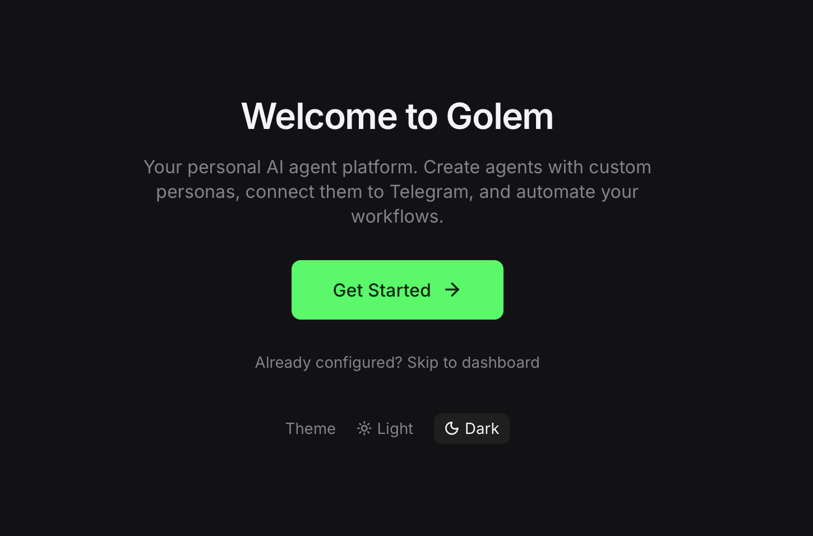
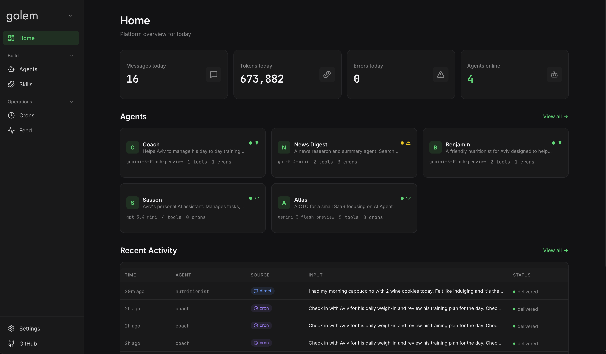
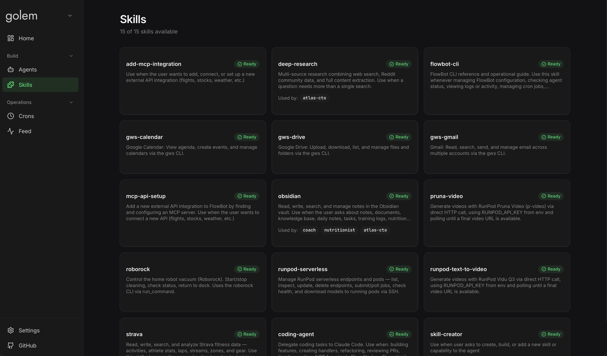

# Golem

A self-hosted platform for creating and managing personal AI agents. Each agent connects to its own Telegram bot and can be configured with custom personas, tools, skills, and MCP server integrations.

Built on [Mastra](https://mastra.ai) + [Vercel AI SDK](https://ai-sdk.dev). Supports [OpenRouter](https://openrouter.ai) (300+ models, pay-per-token) and [OpenAI Codex](https://openai.com/index/introducing-codex/) (ChatGPT subscription, subject to fair-use quota).



## Features

- **Multi-agent platform** — Run multiple agents, each with their own Telegram bot, persona, and toolset
- **Guided onboarding** — Wizard walks you through provider selection, API keys, model tiers, Telegram setup, voice transcription, and your first agent
- **AI-generated personas** — Describe what your agent should do; the system generates a persona with identity, boundaries, and domain expertise
- **Web UI** — Next.js control plane for managing agents, settings, schedules, and activity feeds
- **Working memory** — Persistent scratchpad per agent that remembers preferences, facts, and context across conversations
- **Skills & MCP** — Extend agents with markdown skill modules or Model Context Protocol servers
- **Dual LLM providers** — OpenRouter (pay-per-token, 300+ models) and Codex (ChatGPT Plus/Pro subscription, subject to fair-use quota). Configure during onboarding or add later in the Providers page
- **Conversation tempo** — Agents are aware of elapsed time between messages and adapt their responses accordingly (greetings, context freshness, stale references)
- **Smart recall** — Window-based message history loading with token budgets, replacing static message caps
- **Phoenix observability** — OpenTelemetry tracing for debugging agent behavior

<details>
<summary><strong>Agent Behavior</strong></summary>

- **Configurable behavior** — 5 dropdowns control response style: length, agency, tone, format, and language
- **Proactive check-ins** — Agents initiate unprompted messages on a configurable schedule with probability gates and active-hours windows
- **Group chat support** — LLM-based classification decides when to participate in group conversations (5s timeout fallback)
- **Voice transcription** — Agents transcribe voice notes via Groq's Whisper API (free tier)
- **Sub-agent delegation** — Parent agents delegate specialized tasks to child agents with automatic result compaction

</details>

<details>
<summary><strong>Automation & Integration</strong></summary>

- **Webhook system** — Receive webhooks from external services (GitHub, Strava, CI/CD) with LLM-based scenario classification and field template interpolation
- **Scheduled tasks** — Cron-based scheduling for recurring agent actions
- **Job queue** — Async background tasks for coding, HTTP polling, and custom workflows with retry logic
- **Code agent** — Delegate coding tasks to Claude Code with live progress updates and effort-based model selection

</details>

<details>
<summary><strong>Safety & Reliability</strong></summary>

- **Tool approval workflow** — Destructive operations require owner approval via Telegram buttons with 15-minute expiry
- **Command security** — Allowlist-based binary execution control, configurable via the UI
- **Tool rate limiting** — Max 5 tool calls per step, 15 per turn to prevent runaway loops
- **Stale response detection** — Detects repeated responses and retries with a fallback model
- **Message deduplication** — Per-agent dedup with 5-message sliding window

</details>

<details>
<summary><strong>Context Management</strong></summary>

- **Task tracking** — Per-thread task state (pending/in-progress/completed) injected into agent context with auto-eviction
- **Prompt tracing** — Full prompt/response traces viewable in the UI for debugging
- **Token limiter** — Prevents context overflow by enforcing a 170K token budget per turn
- **Tool error gate** — Automatically disables tools after consecutive failures

</details>



## Quick Start

### Prerequisites

- macOS or Linux (Windows is not supported yet)
- Node.js 20+
- An [OpenRouter](https://openrouter.ai/keys) API key and/or a ChatGPT Plus/Pro subscription (for Codex models)
- A Telegram bot token (from [@BotFather](https://t.me/BotFather))


### Install & Run

```bash
git clone https://github.com/AvivK5498/Golem.git
cd Golem
npm install
cp .env.example .env   # Add your OpenRouter API key
npm start              # Starts the platform on port 3847
```

The web UI starts automatically at **http://localhost:3015**. On first launch, the onboarding wizard guides you through setup.

### Optional: Code Agent

To let your agents delegate coding tasks to [Claude Code](https://claude.ai/code):

```bash
npm install -g @anthropic-ai/claude-code
claude login   # One-time OAuth in browser
```

Once installed, enable the `code_agent` tool on any agent. The agent can then write code, refactor, run tests, and install dependencies by spawning Claude Code sessions.

### Environment Variables

| Variable | Required | Description |
|----------|----------|-------------|
| `OPENROUTER_API_KEY` | Yes | OpenRouter API key for LLM access |
| `GROQ_API_KEY` | No | Groq API key for voice transcription |
| `GOLEM_DATA_DIR` | No | Custom data directory (default: `./data`) |
| `GOLEM_SKILLS_DIR` | No | Custom skills directory (default: `./skills`) |

## Architecture

Golem runs as a single Node.js process with:

- **Backend** (port 3847) — HTTP API, Telegram transports, agent runners, job scheduler
- **Web UI** (port 3015) — Next.js control plane, proxied to backend

All state lives in SQLite databases under the data directory:

| Database | Purpose |
|----------|---------|
| `agents.db` | Agent definitions (config, persona, memory template) |
| `settings.db` | Runtime settings (model tiers, behavior, integrations) |
| `platform-memory.db` | Conversation history and working memory |
| `crons.db` | Scheduled tasks |
| `feed.db` | Activity audit log |

### Agent Message Flow

```
Telegram → Transport → Dedup → Chat classification
  → Media processing (vision / voice transcription)
  → AgentRunner → agent.generate() with memory + tools
  → Response → Telegram
```

### Processors Pipeline

Output processors run after each agent turn, before memory persistence:

- **ImageStripper** — Strips base64 image data from conversation history (including AI SDK v5 `experimental_attachments`)
- **ReasoningStripper** — Removes encrypted LLM reasoning blocks
- **GroupIdentity** — Tags agent responses in group chats

Input processors run before each LLM step:

- **ToolCallFilter** — Strips tool calls from recalled history
- **MessageTimestamp** — Prepends `[N ago]` markers to recalled user messages for tempo awareness
- **TokenLimiter** — Prevents context overflow
- **ToolErrorGate** — Disables tools after repeated failures
- **AsyncJobGuard** — Stops agent loop after async job dispatch

## Skills

Skills are markdown files that teach agents how to use tools for specific tasks. Each skill lives in `skills/<name>/SKILL.md`:

```yaml
---
name: my-skill
description: "What this skill does"
requires:
  env: [API_KEY]
  bins: [some-cli]
---

# My Skill

Instructions for the agent on how to use this skill...
```



## Configuration

All configuration is managed through the web UI — no config files to edit manually.

### Model Tiers

Define 3 model presets (Low / Medium / High) in Settings. Agents select a tier, not a specific model — change the tier's model and all agents using that tier update automatically.

### Command Security

The `run_command` tool uses a strict allowlist. Only explicitly allowed binaries can be executed. Configure in Settings > Command Security with presets (Development, Media, System) or add custom binaries.

### Behavior Dropdowns

Each agent's response style is controlled by 5 configurable dropdowns:

| Setting | Options |
|---------|---------|
| Response Length | Brief / Balanced / Detailed |
| Agency | Execute first / Ask before acting / Consultative |
| Tone | Casual / Balanced / Professional |
| Format | Texting / Conversational / Structured |
| Language | English / Hebrew / Auto-detect |

## Development

### Test Harness

A standalone CLI for testing the full agent pipeline without Telegram:

```bash
npm run test:agent "Hello, what can you do?"
npm run test:agent -- --verbose "Run ls /tmp"
npm run test:agent -- --image /path/to/image.jpg "What do you see?"
```

Uses real LLM calls and reports to Phoenix observability.

### Unit Tests

```bash
bun test
```

## Tech Stack

- **Runtime**: Node.js 20+ / TypeScript (ES modules)
- **Agent Framework**: [Mastra](https://mastra.ai) (@mastra/core)
- **LLM Providers**: [OpenRouter](https://openrouter.ai) (300+ models) + [OpenAI Codex](https://openai.com/index/introducing-codex/) (ChatGPT subscription, fair-use quota)
- **Messaging**: Telegram ([grammY](https://grammy.dev))
- **Memory**: LibSQL (conversation + vectors + working memory)
- **Storage**: SQLite (better-sqlite3)
- **UI**: Next.js 16 + shadcn/ui + Tailwind CSS v4
- **Observability**: Phoenix (OpenTelemetry)
- **Testing**: Bun test runner

## License

MIT
