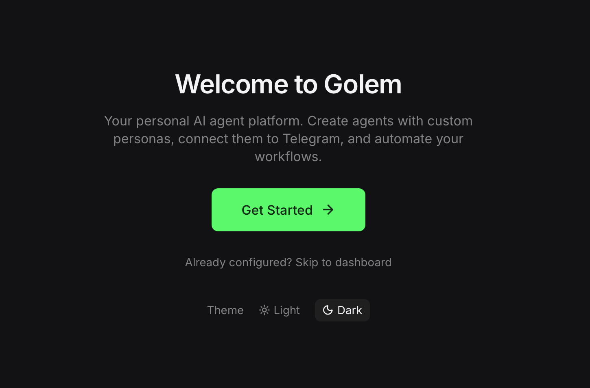
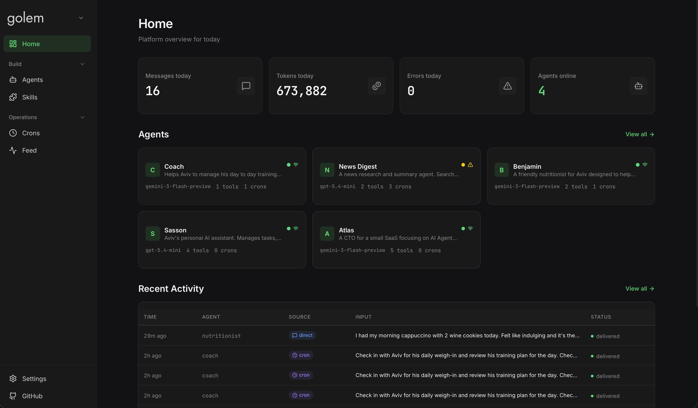
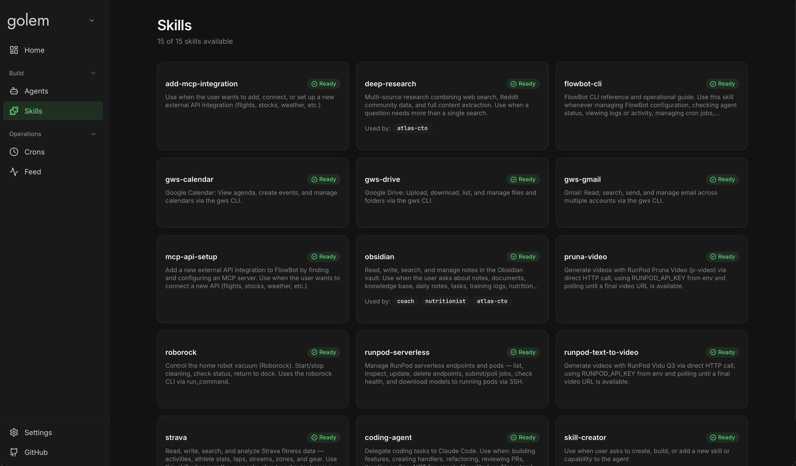

<h1 align="center">Golem</h1>

<p align="center"><strong>Build, configure, and ship an AI agent in minutes.</strong></p>

<p align="center">🤖 Multi-agent &nbsp;•&nbsp; 💬 Telegram-native &nbsp;•&nbsp; 🧠 Working memory &nbsp;•&nbsp; 🔧 Skills & MCP &nbsp;•&nbsp; ⏰ Schedules & webhooks</p>

<p align="center">
  <a href="https://my.vultr.com/deploy/?plan=vc2-1c-1gb&region=fra&os=2284&script=7af88bb2-8947-43a7-b56a-33385eb13c39&ref=9776627"></a>
  <a href="https://mastra.ai"></a>
  <a href="https://openrouter.ai"></a>
  <a href="#license"></a>
</p>



## Quick start

**On a VPS:**

```bash
npm install -g golem-agent
golem install-daemon
```

That's it. The daemon is running under systemd (Linux) or launchd (macOS), survives reboots and SSH logouts. To configure your first agent, open an SSH tunnel from your laptop and visit the wizard:

```bash
ssh -L 3015:localhost:3015 you@your-vps
# then open http://localhost:3015 in your browser
```

**Even faster — one click:** the "Deploy on Vultr" badge above provisions a Vultr instance with Golem pre-installed via a first-boot startup script. SSH in, open the tunnel, walk the wizard.

**Local development:**

```bash
git clone https://github.com/AvivK5498/Golem.git
cd Golem && npm install
cp .env.example .env
npm start                # http://localhost:3015
```

For full install options, see **[docs/INSTALL.md](./docs/INSTALL.md)**. For the CLI reference, **[docs/CLI.md](./docs/CLI.md)**.

## What your agent can do



Each agent runs in its own Telegram bot with a custom persona, working memory, schedules, and a toolset you pick. Out of the box:

- **AI-generated personas** — describe the job in a sentence, Golem writes the prompt.
- **Working memory** — agents remember things between conversations (your coffee order on Monday, used on Friday).
- **Skills & MCP** — drop a `SKILL.md` or wire an MCP server; the agent learns a new trick.
- **Filesystem mounts** — mount an Obsidian vault at `/mnt/<name>`, agents read and write.
- **Schedules & webhooks** — cron-driven check-ins, GitHub/Strava/CI webhook handlers.
- **Voice in, voice out** — Whisper transcription, ElevenLabs TTS replies.
- **Group chats, handled** — LLM classifier decides when to chime in; identity tagging keeps multi-bot rooms sane.
- **Sub-agent delegation** — parent agents hand specialised jobs to specialist children.
- **Code agent** — delegate coding tasks to Claude Code with live progress.
- **Tool approval** — destructive operations ping you on Telegram with Approve/Deny buttons.
- **Phoenix observability** — OpenTelemetry traces for every turn.



## Philosophy

- **Agents act, they don't chat.** Every agent has tools, schedules, webhooks, and the agency to use them. Conversation is one input among many.
- **One bot per job.** Specialized agents beat one mega-prompt. Spin up a research agent, a code agent, a personal assistant — each with its own bot.
- **Telegram-native, not Telegram-bolted-on.** Your agents live where you already are. Voice notes in, voice replies out, group chats, media, buttons.
- **You own the stack.** Your machine, your SQLite, your API keys, your bot tokens. Portable. Forkable. No cloud account required.
- **Configuration is data.** No YAML to edit by hand. The web UI writes SQLite; everything is hot-reloadable.

## Tech stack

Node.js 20+ · TypeScript · [Mastra](https://mastra.ai) · [OpenRouter](https://openrouter.ai) · Telegram ([grammY](https://grammy.dev)) · LibSQL + SQLite · Next.js 16 + shadcn/ui · Phoenix (OpenTelemetry) · Bun test

## License

MIT
